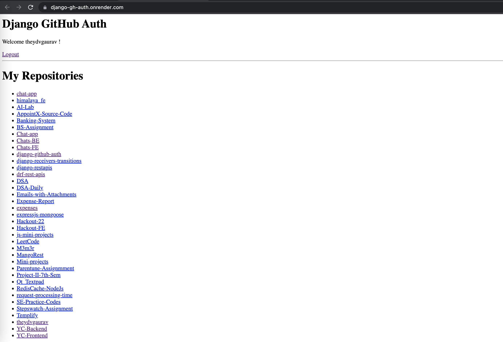

# Django GithubOAuth

A django project which implements GithubOAuth. This application displays the list of repositories an authenticated user has. 

#### [Application Link](https://django-gh-auth.onrender.com/)


## Tech Stack

**Django, PostgreSQL**


## Run Locally

Clone the project

```bash
  git clone https://github.com/theydvgaurav/django-github-auth
```

Go to the project directory

```bash
  cd my-project
```

Create a virtual environment 

```bash
  python3 -m venv env
```

Install the requirements 

```bash
  pip install -r requirements.txt
```

Make a environment variables file named .env in /etc/secrets/.env and put following environment variables

```
DATABASE_NAME=''
DATABASE_USER=''
DATABASE_PASSWORD=''
DATABASE_HOST=''
GH_CLIENT_ID=''
GH_CLIENT_SECRET=''
```

Obtain Github Client Id and Secrets from
```
https://github.com/settings/applications/new
```


## Screenshots

<div align="center">
     
</div>

